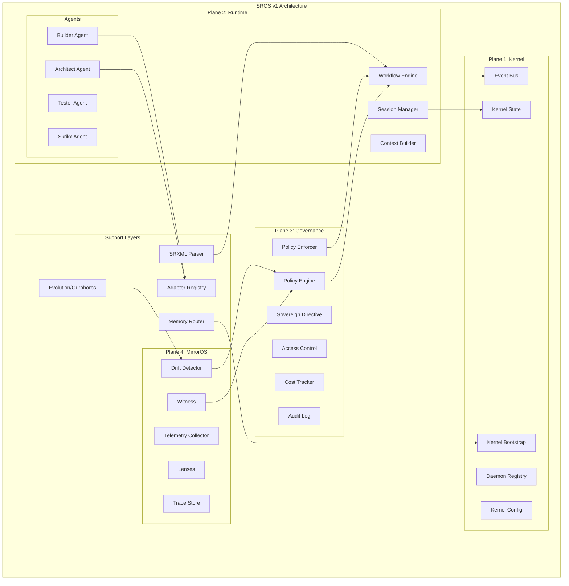
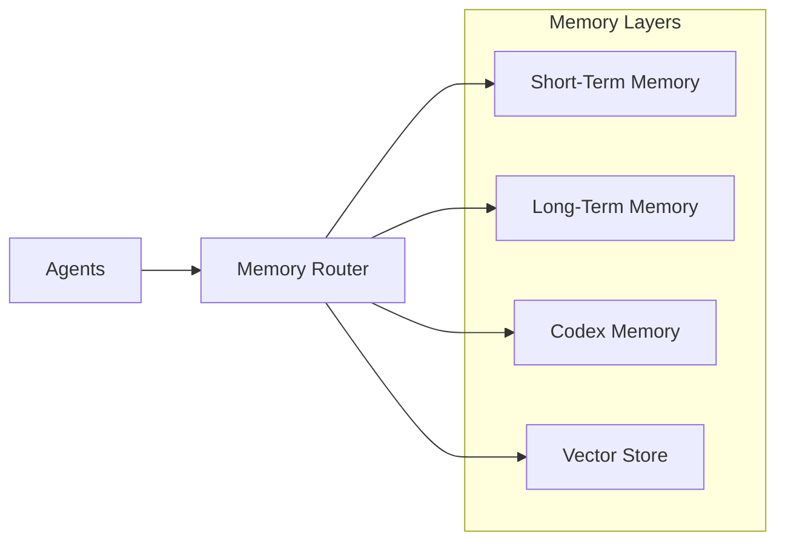
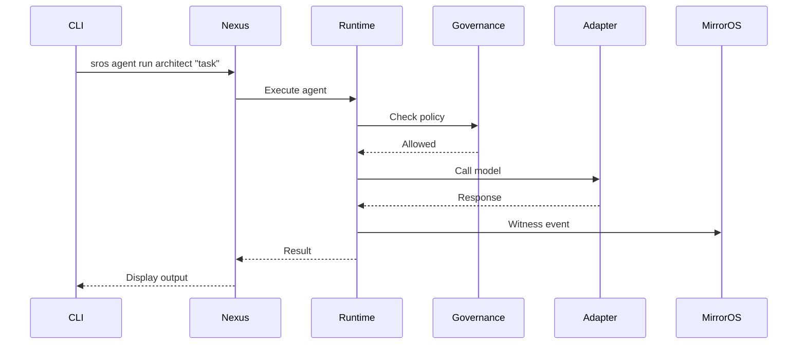
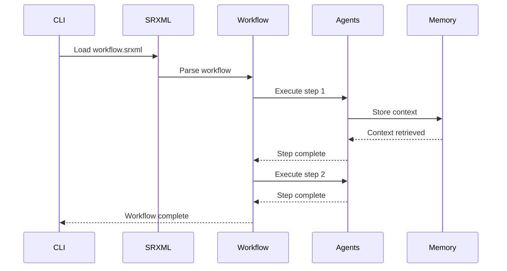

# SROS v1 Architecture

## Overview

SROS (Sovereign Runtime Operating System) is an AI operating system designed to orchestrate complex agentic workflows. It provides a structured environment where AI agents can collaborate, governed by strict policies and observed by a mirror system.



---

## The Four Planes

SROS is organized into four distinct planes, each with specific responsibilities:

### Plane 1: Kernel

**Location**: `sros/kernel/`

The Kernel plane provides the stable backbone of SROS. Everything else is a client of the kernel.

| Module | Purpose |
|--------|---------|
| `kernel_bootstrap.py` | Starts SROS, loads config, initializes memory, registers daemons |
| `kernel_state.py` | Central state: plane status, registered agents, active sessions |
| `kernel_config.py` | Loads `sros_config.yml`, merges env overrides |
| `daemon_registry.py` | Catalog of all daemons with start/stop, health, metadata |
| `event_bus.py` | Core event stream between planes, daemons, and agents |

**Key Events**: `kernel.boot`, `kernel.shutdown`, `kernel.heartbeat`

---

### Plane 2: Runtime

**Location**: `sros/runtime/`

The Runtime plane is where agents live, communicate, and perform tasks. It handles the "physics" of the agent world.

| Module | Purpose |
|--------|---------|
| `workflow_engine.py` | Executes SRXML workflows as graphs |
| `session_manager.py` | Creates and manages logical sessions |
| `context_builder.py` | Builds prompt context from SRXML and session state |

**Agents** (`sros/runtime/agents/`):

| Agent | Role |
|-------|------|
| `architect_agent.py` | System architecture, root-cause analysis |
| `builder_agent.py` | Code generation, structural changes |
| `tester_agent.py` | Test generation and QA |
| `skrikx_agent.py` | Sovereign Prime interface |

---

### Plane 3: Governance

**Location**: `sros/governance/`

The Governance plane enforces rules. Policies, evaluations, safety, and coordination all live here.

| Module | Purpose |
|--------|---------|
| `policy_engine.py` | Evaluates policies, decides allow/deny/modify |
| `policy_enforcer.py` | Enforces policy decisions on actions |
| `sovereign_directive.py` | High-level sovereign commands |
| `access_control.py` | User, role, and agent permissions |
| `cost_tracker.py` | Tracks API costs and budgets |
| `audit_log.py` | Append-only log of critical events |

**Key Events**: `governance.policy.check`, `governance.access.denied`, `governance.cost.exceeded`

---

### Plane 4: MirrorOS

**Location**: `sros/mirroros/`

MirrorOS provides self-awareness: witnessing, lenses, drift detection, and introspection.

| Module | Purpose |
|--------|---------|
| `witness.py` | Low-level logging entry point |
| `lenses.py` | Filters/transforms over witness data (temporal, risk, identity) |
| `trace_store.py` | Storage for traces and sessions |
| `drift_detector.py` | Watches behavior against baselines |
| `telemetry_collector.py` | Collects runtime metrics and traces |

**Key Events**: `mirroros.witness`, `mirroros.drift.detected`, `mirroros.trace.stored`

---

## Support Layers

### SRXML

**Location**: `sros/srxml/`

SRXML is the primary language for schemas, agents, and flows. It is the glue that connects all planes.

```
sros/srxml/
├── parser.py          # Reads SRXML files into Python structures
├── validator.py       # Validates SRXML against schemas
├── models/            # Pydantic models for SRXML elements
│   ├── workflow.py
│   ├── agent.py
│   ├── policy.py
│   └── ...
├── schemas/           # XML schemas for validation
└── templates/         # Canonical starting points
```

---

### Memory

**Location**: `sros/memory/`

SROS owns memory. Models plug in, but memory is controlled by the OS.



| Layer | Purpose | Persistence |
|-------|---------|-------------|
| Short-Term | Session-scoped data | Session lifetime |
| Long-Term | Cross-session persistent | Permanent |
| Codex | Knowledge packs and domain knowledge | Permanent |
| Vector | Semantic search and embeddings | Permanent |

---

### Adapters

**Location**: `sros/adapters/`

Adapters keep SROS pure and models/tooling pluggable.

```
sros/adapters/
├── base.py            # Base adapter interface
├── registry.py        # Adapter registration and discovery
├── models/            # Model adapters
│   ├── gemini_adapter.py
│   ├── openai_adapter.py
│   └── local_adapter.py
├── tools/             # Tool adapters
└── storage/           # Storage adapters
```

---

### Evolution (Ouroboros)

**Location**: `sros/evolution/`

The self-improvement engine. SROS can analyze and propose improvements to itself.

| Module | Purpose |
|--------|---------|
| `ouroboros.py` | Main self-evolution orchestrator |
| `analyzer.py` | Analyzes system behavior and patterns |
| `proposer.py` | Proposes improvements and changes |
| `observer.py` | Observes execution for learning |
| `safeguards.py` | Safety checks for self-modification |

---

## Data Flow

### Agent Execution Flow



### Workflow Execution Flow



---

## Configuration

### Main Configuration

**File**: `sros_config.yml`

```yaml
version: "1.0"
tenant: "default"
environment: "dev"

kernel:
  debug: false
  log_level: "INFO"

adapters:
  default_model: "gemini"
  
memory:
  backend: "sqlite"
  path: "data/memory.db"

governance:
  enforce_policies: true
  cost_budget_daily: 100.0
```

### Environment Variables

| Variable | Purpose |
|----------|---------|
| `GEMINI_API_KEY` | Gemini API authentication |
| `OPENAI_API_KEY` | OpenAI API authentication |
| `SROS_DEBUG` | Enable debug mode |
| `SROS_LOG_LEVEL` | Logging verbosity |

---

## Directory Structure

```
sros-v1-alpha/
├── pyproject.toml          # Package configuration
├── README.md               # Project overview
├── VERSION                 # Version file
├── sros_config.yml         # Global configuration
├── sros/                   # Main package
│   ├── kernel/             # Plane 1: Kernel
│   ├── runtime/            # Plane 2: Runtime
│   ├── governance/         # Plane 3: Governance
│   ├── mirroros/           # Plane 4: MirrorOS
│   ├── srxml/              # SRXML parser and schemas
│   ├── memory/             # Memory backends
│   ├── adapters/           # Model and tool adapters
│   ├── evolution/          # Self-improvement (Ouroboros)
│   ├── nexus/              # CLI and API
│   ├── codex/              # Knowledge packs
│   └── apps/               # Demo applications
├── tests/                  # Test suite
├── examples/               # Example SRXML files
└── docs/                   # Documentation
```

---

## See Also

- [README.md](../README.md) - Quick start guide
- [API_REFERENCE.md](API_REFERENCE.md) - HTTP API documentation
- [CLI_GUIDE.md](CLI_GUIDE.md) - Command-line interface
- [DEMO.md](DEMO.md) - Demo walkthrough
- [SROS_STUDY_GUIDE_v1.md](SROS_STUDY_GUIDE_v1.md) - Learning guide
